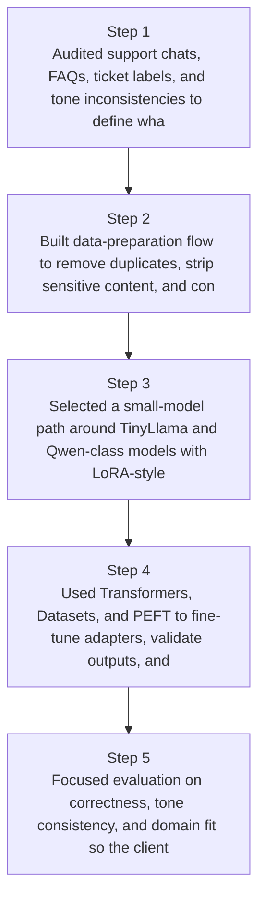
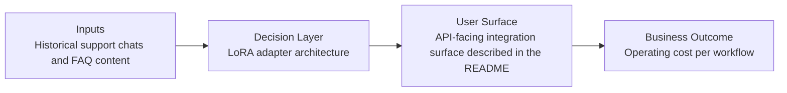
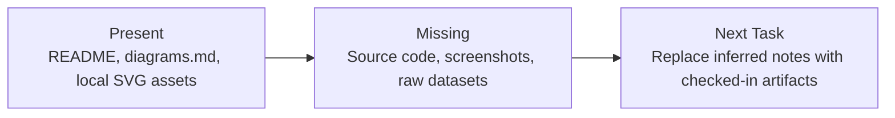

# Brand-Tuned Support Assistant Diagrams

Generated on 2026-04-26T04:29:37Z from README narrative plus project blueprint requirements.

## Fine-tuning pipeline diagram

## LoRA adapter architecture

## Evidence Gap Map

